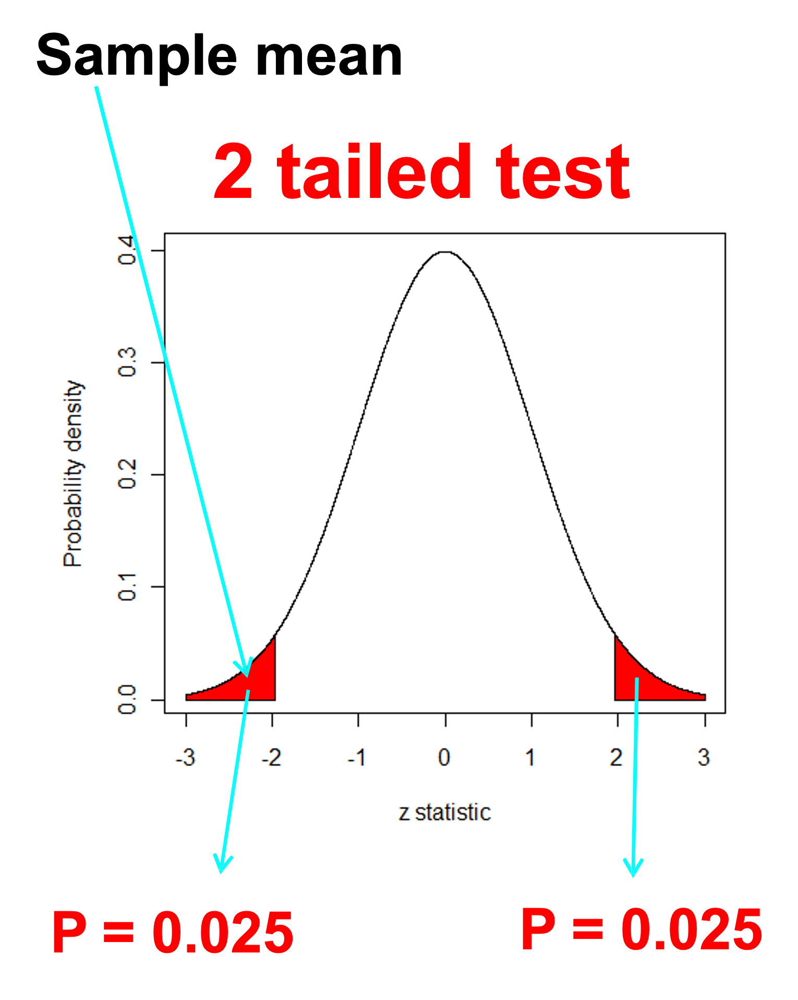
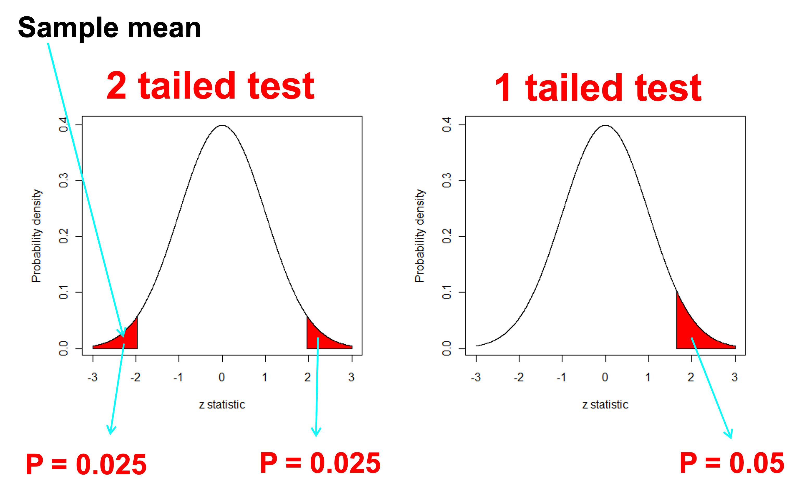
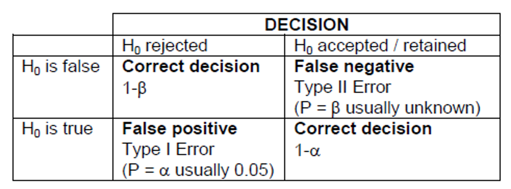
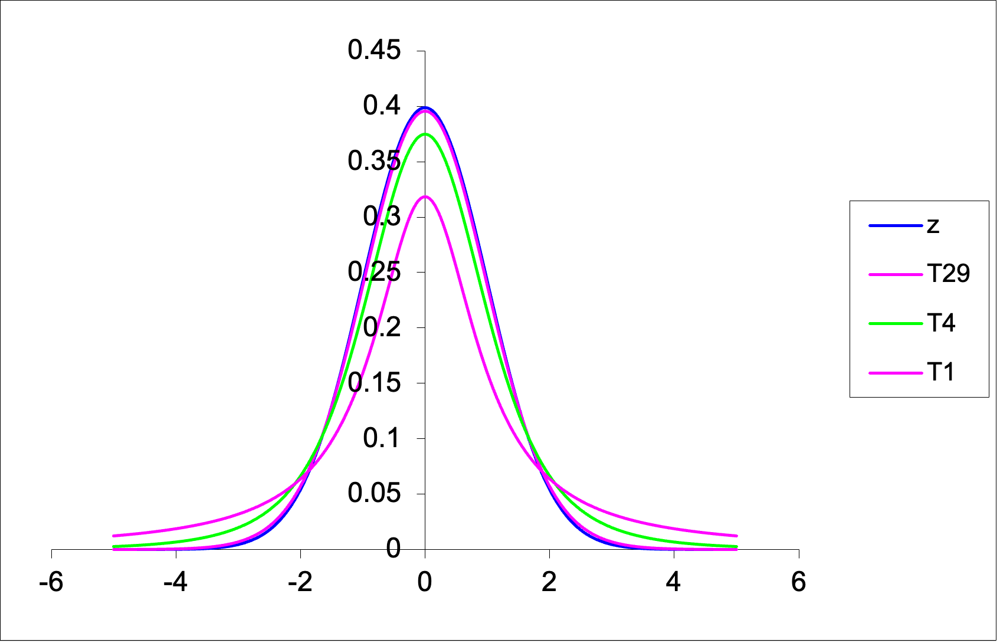
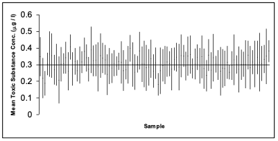
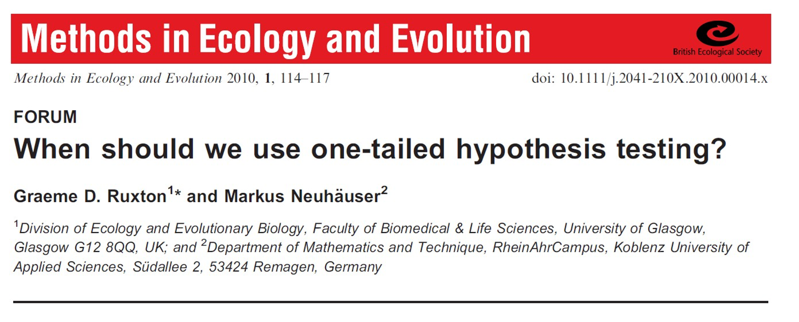

## Important Notice

:::: {.columns}

::: {.column width="50%"}

The Faculty has been informed of instances where students are being targeted by illegitimate academic services, which could potentially lead to plagiarism or other breaches.

This can include:

- “tutoring” services who provide assignment instructions or model answers;
- using another person or company to write or complete your assignment;
- using online file-sharing sites that lead to plagiarism.

Engaging in such activities could constitute a breach of the Academic Integrity Policy  and may result in penalties, including failing the assignment, the unit, or even a suspension or exclusion for misconduct.

:::

::: {.column width="50%"}

We want you to do well on assessments. Contact the Learning Hub, your tutor, or Unit Coordinator to get support.

There are resources available to help you. Don’t be afraid to ask for help.


:::

::::

# Outline

- Why do inferential statistics?
- Hypothesis testing;
- One-sample tests;
- Confidence intervals;
- Transformations.

## Learning outcomes

::: {style="background-color: yellow; padding: 10px; border: 1px solid black;"}
**LO1**. By the end of this course, students will be able to implement basic reproducible research practices—including consistent data organization, documented code, and version-controlled workflows—so that their statistical analyses and results can be readily replicated and validated by others.
:::

::: {style="background-color: yellow; padding: 10px; border: 1px solid black;"}
**LO2**. By the end of this course, students will demonstrate proficiency in utilizing R and Excel to effectively explore and describe life science datasets.
:::

::: {style="background-color: yellow; padding: 10px; border: 1px solid black;"}
**LO3**. By the end of this course, students will be able to apply parametric and non-parametric statistical inference methods to experimental and observational data using RStudio and effectively interpret and communicate the results in the context of the data.
:::

LO4. By the end of this course, students will be able to put into practice both linear and non-linear models to describe relationships between variables using RStudio and Excel, demonstrating creativity in developing models that effectively represent complex data patterns.

::: {style="background-color: yellow; padding: 10px; border: 1px solid black;"}
**LO5**. By the end of this course, students will be able to articulate statistical and modelling results clearly and convincingly in both written reports and oral presentations, working effectively as an individual and collaboratively in a team, showcasing the ability to convey complex information to varied audiences.
:::


## Inferential statistics

- So far we have focused on Exploratory Data Analysis **EDA**;
- **EDA** helps us describe and visualise data;
- **Inferential statistics** takes the next step: using a **sample** to learn about a **population**;
- This is an important and sometimes difficult step in statistics;
- Because samples vary by chance, we need formal methods to decide whether an observed difference is likely to reflect the real effect.


## Hypothesis testing

- In statistics, a **hypothesis** is a claim about a population parameter.
- We often begin with a **benchmark** or **reference value**
- We then ask:

> Is our sample consistent with that claim, or is the difference too large to plausibly due to chance alone?


## Hypothesis testing

:::: {.columns}

::: {.column width="50%"}

- Suppose the guideline value for Total Nitrogen (TN) at a site along a river is $500 \mu g/L$
- We might ask

> Is the mean TN concentration at this site equal to $500 \mu g/L$, or is it different?

- This gives us a natural hypothesis test:
  - **Null hypothesis** $H_0:$ the mean TN concentration is $500 \mu g/L$
  - **Alternative hypothesis** $H_1:$ the mean TN concentration is **NOT** $500 \mu g/L$

:::

::: {.column width="50%"}


:::

::::


## Hypothesis testing workflow

**We will follow the steps in hypothesis testing**

1. State the hypotheses;
2. Check assumptions;
3. Calculate the test statistic;
4. Obtain P-value, critical value, confidence intervals;
5. Draw the statistical conclusion;
6. Write a scientific (biological) conclusion.


## Hypothesis testing workflow

A useful acronym is **HATPC**:

- **H:** Hypothesis
- **A:** Assumptions
- **T:** Test statistic
- **P:** P-Value
- **C:** Conclusion


## H: Hypothesis

- The **null hypothesis** $(H_0)$ is the benchmark or reference claim
- The **alternative hypothesis** $(H_1)$ is the competing claim we are interested in.

For example

- $H_0:\mu = 500 \mu g/L$
- $H_1:\mu \ne 500 \mu g/L$


## A: Assumptions

- Before carrying out a t-test, we need to check whether its assumptions are reasonable;
- For a one sample t-test, an important assumption is that the sample data is approximately normally distributed.
- We usually check this by:

1. looking at the data using plots
2. Checking for strong skewness or outliers
3. Optionally using a formal test such as the Shapiro-Wilk test

## T: Test Statistic 

A test statistic measures how far the observed result is from what we would expect under the null hypothesis.

$\text{Test statistic}=\frac{\text{Observed value - Expected value}}{\text{Standard error}}$

This is essentially

$=\frac{\text{Signal}}{\text{Noise}}$

- **Numerator** = difference from the null value
- **Denominator** = uncertainty in that estimate


## P: p-value

- The **p-value** tells us how unusual our results would be **if the null hypothesis were true**

More formally:

- It is the probability of observing the test statistic, or something more extreme, assuming $H_0$ is true.

So the p-value helps us judge whether the data are **consistent with** the null hypothesis.


## P: p-value

**What does this have to do with sampling distributions??**




## P: p-value

A useful memory aid is:

**"If the P-value is low the Null hypothesis must go."** 

But more formally:

- If $p < 0.05$ the data provide evidence against $H_0$
- If $p \ge 0.05$ the data do not provide strong evidence against $H_0$

Important:

- We **do not accept** $H_0$
- We say **we fail to reject** $H_0$


## P: p-value

**Common mistakes**

- The p-value is not the chance that the NULL hypothesis is true
- A large p-value does not mean that $H_0$ is true


- The use of 0.05 is not mandatory, it is a convention.
- Other levels such as 0.01 or 0.001 may also be used.


## P: p-value

**Controversy**

[Nature article 1](https://www.nature.com/news/statisticians-issue-warning-over-misuse-of-p-values-1.19503) 

[Nature article 2](https://www.nature.com/articles/d41586-019-00857-9) 

- Should we move away from an over reliance on p-values towards more robust statistical methods and a greater emphasis on the size and reproducibility of effects?
- Look up terms like **"P Hacking"**...


## C: Conclusion

At the end of a statistical test we write two conclusions

1. A **statistical conclusion** based on the test statistic, confidence intervals, p-value and the level of significance i.e. we reject or fail to reject $H_0$
2. A **scientific (biological) conclusion** what does this mean in the context of the study.


## One or Two - Tails




## One or Two - Tails

- Suppose we want to compare a sample population or sample mean $(\mu)$ to a benchmark value $(c)$ - Could be our water quality benchmark of $c=500 \mu g/L$

  - $H_0:\mu=c$ *Two tailed*
  - $H_1:\mu \ne c$ *Two tailed*
  
  - $H_0:\mu \ge c$ *One tailed - less than*
  - $H_1:\mu < c$ *One tailed - less than*

  - $H_0:\mu \le c$ *One tailed - greater than*
  - $H_1:\mu > c$ *One tailed - greater than*
  
- We usually use the first (two tailed) form unless we are specifically interested in testing whether the difference is in one direction because this is the only direction of interest


## One-tailed tests (water quality)

| Goal | Hypotheses | Tail |
|------|-----------|------|
| Detect unsafe water | H₀: μ ≤ c, H₁: μ > c | Right |
| Demonstrate safe water | H₀: μ ≥ c, H₁: μ < c | Left |

> **Rule:** The tail follows the alternative hypothesis (H₁)


## Type one or type two error

**Type I error**

- False positive: we reject H0  when it is true 

**Type II error**

- False negative: we accept H0  when it is false



**Note:** Decreasing the significance level ($\alpha$) to say 0.01 will increase the probability of type II error


## Sample size and power

**Power** is the probability a test will detect a real effect when one exists.

- **High power** means a low chance of type II error;
- **Low power** means a higher chance of missing a real effect.

In general:

- larger sample sizes increase power;
- smaller standard deviations increase power;
- larger effects are easier to detect.


## The t-distribution

:::: {.columns}

::: {.column width="50%"}

The t-distribution is:

-	bell-shaped;
- symmetric;
- centred on zero;
- similar in shape to the normal distribution, but with **heavier tails**.

Its exact shape depends on the **degrees of freedom**

- For a one-sample t-test $df=n-1$ where n is the sample size.
- As the sample size increases, the t-distribution becomes more similar to the normal distribution.

:::

::: {.column width="50%"}



:::

::::


## Class exercise: One sample t-test

Suppose we wish to test whether the mean resting heart rate of ENVX1002 students differs from a benchmark value of 70 beats per minute (bpm). 

We are going to do this exercise in class but I have provided a simulated example below so you have it in the slides as well.

## Class exercise: One sample t-test

We will simulate some data for 30 students in our ENVX1002 class. To do this we will draw 30 random numbers from a normal distribution with a mean of 70 and a standard deviation of 10.

```{r}
set.seed(1974)
heart_rate <- rnorm(30, mean = 70, sd = 10)
```

## Class exercise: <span style="color: blue;">**H**</span>ypothesis

**State the Null and Alternate hypothesis!**

- $H_0: \mu = 70 \text{ bpm}$	(Null hypothesis)

- $H_1: \mu \ne 70 \text{ bpm}$	(Alternate hypothesis)


## Class example: <span style="color: blue;">**A**</span>ssumptions

Before applying a one-sample t-test, we should check whether the sample is approximately normally distributed. Consider the following:

| Sample size | Histogram | Q-Q plot | Jitter plot | Boxplot | Shapiro test |
|-------------|-----------|----------|-------------|---------|--------------|
| **Small** (*n* < 30) | Limited | **Best** | **Very useful** | **Useful** | Cautious use |
| **Medium** (30–100) | Useful | **Very useful** | Useful | Useful | Sometimes useful |
| **Large** (*n* > 100) | Useful | **Best** | Less useful | **Good (outliers)** | Too sensitive |

> **Rule of thumb:**  
> - Small *n*: **show the data** (jitter) + Q-Q plot  
> - Larger *n*: **histogram + Q-Q plot**  
> - Use boxplots to highlight **spread and outliers**, not normality alone

## Class example: <span style="color: blue;">**A**</span>ssumptions

We begin by looking at the data (EDA). Our sample size is 30 so we can look at the histogram, Q-Q plot and jitter plot.

```{r}
#| fig-width: 8
#| fig-height: 3.4

library(ggplot2)
library(patchwork)

df <- data.frame(heart_rate)

p1 <- ggplot(df, aes(heart_rate)) +
  geom_histogram(fill = "grey80", colour = "white", bins = 30) +
  labs(title = "Histogram", x = "Heart rate", y = "Count") +
  theme_minimal()

p2 <- ggplot(df, aes(sample = heart_rate)) +
  stat_qq() +
  stat_qq_line(colour = "red") +
  labs(title = "Q-Q plot", x = "Theoretical", y = "Sample") +
  theme_minimal()

p1 + p2
```


## Class example: <span style="color: blue;">**A**</span>ssumptions

As an option, we can also use the Shapiro-Wilk test as a supporting check. Best if the sample size is less than 50.

- If \(p > 0.05\), we do not have strong evidence against normality;
- This does not prove normality, but suggests the t-test may be reasonable.

```{r}
shapiro.test(heart_rate)
```


## Class example: <span style="color: blue;">**T**</span>est

For a one-sample t-test, the test statistic is:

$t = \frac{\bar{y} - \mu}{s/\sqrt{n}}$

where:

- $\bar{y}$ = sample mean
- $\mu$ = null (benchmark) value
- $s$ = sample standard deviation
- $n$ = sample size


## Class example: <span style="color: blue;">**T**</span>est

<span style="color: blue;">**CI**</span> &
<span style="color: blue;">**T**</span>-Statistic & 
<span style="color: blue;">**P**</span>-value

:::: {.columns}

::: {.column width="50%"}


In R, the one-sample t-test gives us:

- the test statistic
- degrees of freedom
- the p-value
- the confidence interval
- the sample mean

```{r}
t.test(heart_rate,
  mu = 70,
  alternative = "two.sided",
  conf.level = 0.95
)
```

:::

::: {.column width="50%"}

We can see the following output:

- the t-statistic = 0.25373
- the degrees of freedom = 29 $(n-1)$
- the p-value = 0.8015
- the 95% confidence interval = (66.76984 74.14513)
- the sample mean = 70.45748

:::

::::

## Class example: <span style="color: blue;">**C**</span>onclusion

### Statistical conclusion
Because \(p = 0.8015 > 0.05\), we **fail to reject the null hypothesis**.

### Scientific conclusion
The data do not provide strong evidence that the mean resting heart rate of ENVX1002 students differs from 70 bpm.

Also note:
- 70 bpm lies within the 95% confidence interval
- this is consistent with the non-significant test result 


## Confidence intervals

A **confidence interval** gives a range of plausible values for an unknown population parameter.

Many people prefer confidence intervals because they show:

- the estimated value
- the uncertainty around that estimate

A hypothesis test gives a decision about a claim.
A confidence interval gives a plausible range.


## Confidence intervals - known variance

- Assuming our sample comes from a normal population, we can calculate the confidence interval for the mean of a population when the population **variance is known**. An example may be in manufacturing where we know the variance of a process.
- The formula for the confidence interval is:

$CI = \bar{y} \pm Z_{\alpha/2} \cdot \frac{\sigma}{\sqrt{n}}$

for the 95% confidence interval, $\alpha = 0.05$ and $Z_{\alpha/2} = 1.96$ i.e. 2 standard errors from the mean.


## Confidence intervals - Unknown variance

In practice, we usually do **not** know the population variance.

In that case, we use the t-distribution:

$CI = \bar{y} \pm t_{\alpha/2,df}\frac{s}{\sqrt{n}}$

where:

- $s$ is the sample standard deviation
- $df = n - 1$

```{r}
qt(0.975, df = 29) ## in our heart rate example, n=30 so df = 29 
```


## Confidence intervals - Unknown variance

- The following is simulation of 100 studies, each containing n = 6 observations of a fictitious toxic substance concentration ($\mu g / l$) assumed to be $\sim N(0.3, 0.12)$. 
- For each sample the 95% confidence interval calculated: 



## Confidence intervals - Unknown variance

- In the graph on the previous slide, a confidence interval includes the true mean value of 0.3 if the vertical line (representing the width of the CI) crosses the horizontal line.
- We have to accept that 5% of the time we will not capture the true mean.
- We can widen the confidence interval to 99% so we are more confident but this can increase the chance of a type II error. 


## Example 2: Water Quality 

Let's look at our water quality example again:

- The data is Total Nitrogen (TN) levels @ Wallacia in western Sydney on the Nepean River
- According to the ANZECC guidelines, the maximum acceptable level of TN in an lowland river is 500 $\mu g/L$ and for an upland river = 250 $\mu g/L$. (see Table 3.3.2 in Australian and New Zealand Guidelines for Fresh and Marine Water Quality)
- We want to know if the observed mean value of TN in our sample is different to the guideline value of 500 $\mu g/L$

```{r}
TN <- read.csv("data/TN_Wallacia.csv")
str(TN)
```
  

## Example 2: Water Quality

**State Hypothesis**

:::: {.columns}

::: {.column width="50%"}

- $H_0: \mu = 500$ $\mu g/L$ (Null hypothesis)
- $H_1: \mu \ne 500$ $\mu g/L$ (Alternate hypothesis)

:::

::: {.column width="50%"}


:::

::::


## Example 2: Water Quality

**Check assumptions**

What do we notice about the plots? Does the data look normally distributed? Do we see strong skewness or outliers?

:::: {.columns}

::: {.column width="50%"}

```{r}
library(ggplot2)
library(gridExtra)

# Histogram
p1 <- ggplot(TN, aes(x = TN)) +
  geom_histogram(
    fill = "blue", color = "black",
    bins = 7
  ) +
  xlab("Total Nitrogen (ug/L)") +
  theme_minimal()

# Boxplot
p2 <- ggplot(TN, aes(x = TN)) +
  geom_boxplot(fill = "blue") +
  xlab("Total Nitrogen (ug/L)") +
  theme_minimal()

# Q-Q plot
p3 <- ggplot(TN, aes(sample = TN)) +
  stat_qq() +
  stat_qq_line(col = "red") +
  theme_minimal()

```

:::

::: {.column width="50%"}

```{r}
# Arrange the plots in a 2x2 layout
grid.arrange(p1, p2, p3, ncol = 2)
```

:::
::::


## Example 2: Check assumptions

**Shapiro-Wilk normality test**

- For smaller sample sizes, we can use the Shapiro-Wilk test (say < 50) to confirm whether the data is normally distributed or not.

```{r}
shapiro.test(TN$TN)
```

- We see P<0.05 so we **reject** the null hypothesis that the data is normally distributed.
- For really large samples (>>30) the central limit theorem suggests that the distribution of the sample means tends to be normal. However, extreme skewness, heavy tails, or outliers can still affect the test's performance.


## Example 2: Transformations

For right (positive) skewed data, we can use a 

- $1/x$ inverse transformation for highly skewed data.
- $\log_{10}$ or $\log_e$ transformation for very skewed data. 
- $\sqrt{x}$ square root transformation for moderately skewed data.
  
For left (negative) skewed data (which is rare to find), we can "try" a

- $x^2$, $x^3$ or $e^x$ transformation.


## Example 2: Transformations & Recheck assumptions

Let's try a log10 transformation:

- We start by creating a new column in our data frame called log10_TN
- We then take the log10 of the TN column and store it in the new column - note we could also use "mutate" from the dplyr package to do this.

```{r}
TN$log10_TN <- log10(TN$TN)
```

## Example 2: Recheck assumptions

:::: {.columns}

::: {.column width="50%"}

```{r}
library(ggplot2)
library(gridExtra)

# Histogram
p1 <- ggplot(TN, aes(x = log10_TN)) +
  geom_histogram(
    fill = "blue", color = "black",
    bins = 7
  ) +
  xlab("Log10 Total Nitrogen (ug/L)") +
  theme_minimal()

# Boxplot
p2 <- ggplot(TN, aes(x = log10_TN)) +
  geom_boxplot(fill = "blue") +
  xlab("log10 Total Nitrogen (ug/L)") +
  theme_minimal()

# Q-Q plot
p3 <- ggplot(TN, aes(sample = log10_TN)) +
  stat_qq() +
  stat_qq_line(col = "red") +
  theme_minimal()

```

:::

::: {.column width="50%"}

```{r}
# Arrange the plots in a 2x2 layout
grid.arrange(p1, p2, p3, ncol = 2)
```

:::
::::


## Example 2: Recheck assumptions

**Shapiro-Wilk normality test**

```{r}
shapiro.test(TN$log10_TN)
```

- From our previous slide, our data seems to be quite symmetrical
- Now P>0.05 so we **fail to reject** the null hypothesis that the data is normally distributed.
- We can now proceed with our t-test using the log transformed data.

## Example 2: Restate the hypotheses

- We will also need to transform the hypothesised mean of 500 to the log10 scale.

- $H_0: \mu = \log_{10}(500)$ $\mu g/L$ (Null hypothesis)
- $H_1: \mu \ne \log_{10}(500)$ $\mu g/L$ (Alternate hypothesis)


## Example 2: T-test & P-Value

```{r}
t.test(TN$log10_TN,
  mu = log10(500),
  alternative = "two.sided",
  conf.level = 0.95
)
```

- The p-value is <0.001 (3.d.p.) which is less than 0.05. Therefore, we reject the null hypothesis. 
- There is strong evidence that the mean value of TN in Nepean River is different to 500 ug/L. 
- Can we say something about the direction??


## Example 2: Geometric mean & Confidence intervals

**Geometric mean**

Note that now we are looking at the geometric mean as opposed the the arithmetic mean which was 855.86 in our case

```{r}
10^mean(TN$log10_TN)
```

**Confidence intervals**

- We need to back transform the confidence interval to the original scale.
- To back-transform the confidence interval we can use the following:

$10^{CI_{low}}$ and $10^{CI_{high}}$

```{r}
10^(2.81)
10^(2.97)
```

- This means that we are 95% confident that the geometric mean (back-transformed mean) of the sample is between approximately 646 and 933 ug/L. This is higher than the hypothesised mean.


## Example 2: Conclusion

1. The data was log10 transformed to meet the assumptions of the t-test.
2. We have strong evidence that the mean value of Total Nitrogen in Nepean River is different to 500 ug/L.
3. We are 95% confident that the geometric mean (back-transformed mean) of the sample is between approximately 646 and 933 ug/L.
4. Looking at the confidence interval, we can say that the mean value of TN in Nepean River is significantly greater than 500 ug/L.


## Example 3: One tailed test

- We can also use a one tailed test if we are specifically interested in whether the observed value is greater or less than the expected value.
- In this case we only want to know if the TN concentration is greater than the ANZECC guidelines of 500 $\mu g/L$.

> Detect unsafe water | H₀: μ ≤ 500, H₁: μ > 500 |

OR

> Detect unsafe water | H₀: μ ≤ $\log_{10}(500)$, H₁: μ > $\log_{10}(500)$ |


## Example 3: One tailed test

```{r}
t.test(TN$log10_TN,
  mu = log10(500),
  alternative = "greater",
  conf.level = 0.95
)
```

- P < 0.001 (3.d.p.) so we reject the null hypothesis.
- Because we are doing a one tailed test we can now conclude that the mean value of TN in Nepean River is greater than $\log_{10}(500)$ $\mu g/L$
- Take a look at the confidence interval and the p-value. What do you notice when comparing to the two tailed test?


## Example 3: One tailed test

[Ruxton and Neuhäuser 2010](https://besjournals.onlinelibrary.wiley.com/doi/full/10.1111/j.2041-210X.2010.00014.x)




# References

- Quinn G. P. & Keough M. J. (2002) Experimental design and data analysis for biologists. Cambridge University Press, Cambridge, UK.
- Logan, M. (2010). Biostatistical design and analysis using R a practical guide. Hoboken, N.J., Wiley-Blackwell.
- Fox, G. A., S. Negrete-Yankelevich, and V. J. Sosa. (2015). Ecological statistics: contemporary theory and application. Oxford University Press, USA
- Ruxton, G.D. and Neuhäuser, M., 2010. When should we use one-tailed hypothesis testing? Methods in Ecology and Evolution, 1 (2), 114-117.


# Thanks!

This presentation is based on the [SOLES Quarto reveal.js template](https://github.com/usyd-soles-edu/soles-revealjs) and is licensed under a [Creative Commons Attribution 4.0 International License][cc-by].


<!-- Links -->
[cc-by]: http://creativecommons.org/licenses/by/4.0/